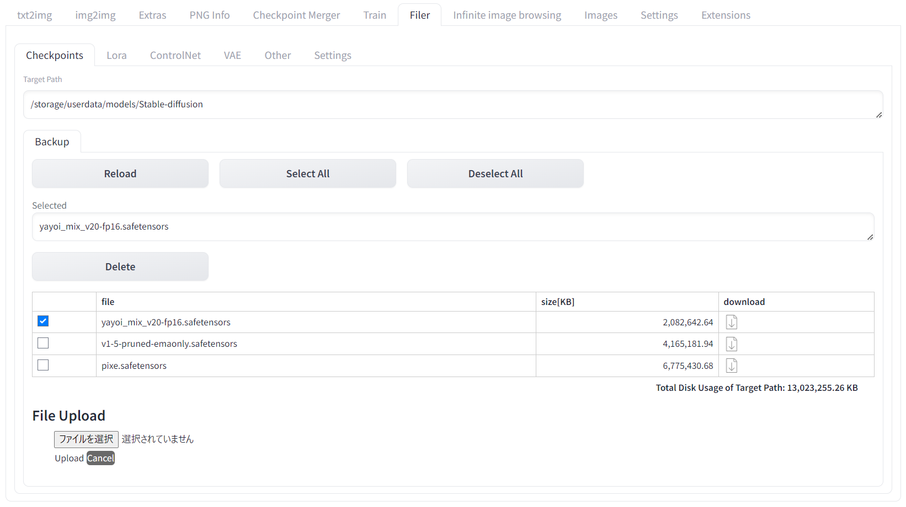
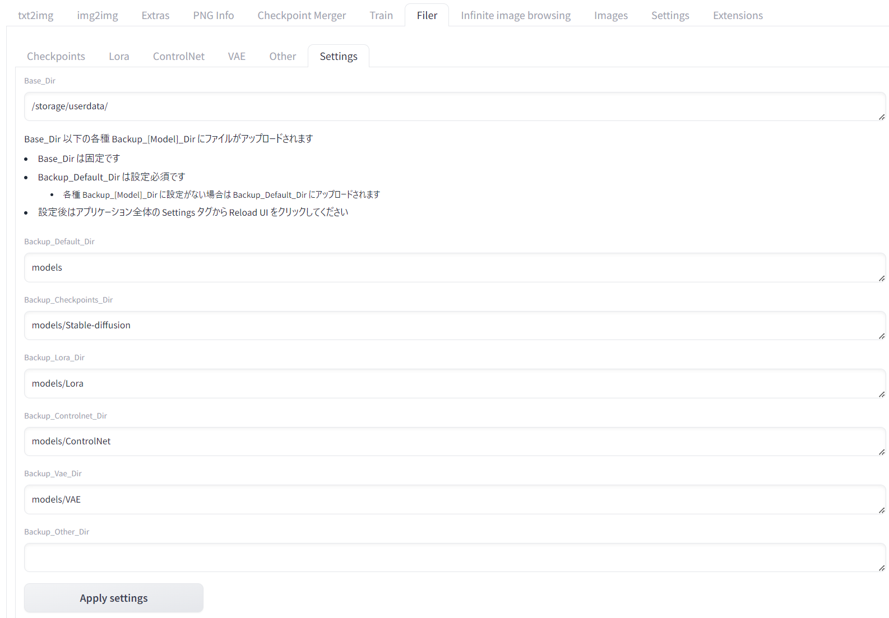

# saas_filer
弊社提供サービス [GPUSOROBAN 画像生成SaaS](https://imagegen.highreso.jp/) 専用のファイルマネージャーです

※当サービスの機能を補完することを目的としているため、その他の環境で動作させることは一切想定しておりません

画像生成に必要なモデルファイルを、web上で指定パスにアップロードすることを主としたシンプルな拡張機能になります

 

# 機能

当拡張機能をインストールすると Stable Diffusion Web UI　に「Filer」というタブが追加されます  
Filer タブの中に各モデルに紐づいたタブがあリます  
- Checkpoints
- Lora
- ControlNet
- VAE
- Other  
その他ファイルのアップロードとして汎用的に利用できます

各タブ内の機能・操作については同様です

また、各モデルのアップロード設定を行うための以下のタブがあります
- Settings

## 各モデルタブ

### Target Path  
Settings タブ内で設定したアップロード先のディレクトリが表示されます

### ボタン & 欄

- 「Reload」  
Target Path 内の最新の状態を一覧に表示します

- 「Select All」  
ファイル一覧に表示されている全てのファイルを選択状態にします

- 「Deselect All」  
ファイル一覧に表示されている全てのファイルを未選択状態にします

- Selected  
選択状態のファイルをカンマ区切りで全て表示します

- 「Delete」  
選択状態のファイルを全て削除します

### ファイル一覧
Target Path のファイルの状態を表示します  
（一度 Reload ボタンをクリックした後で表示されます）

  - checkbox
    - チェックすると「Selected」欄に表示されます
  - file
    - Target Path 以下でファイルのパスを表示します
  - size[KB]
    - ファイルサイズを表示します
  - download
    - アイコンクリックでダウンロード開始します
    - 停止したい場合はブラウザ側で停止してください
  - Total Disk Usage of Target Path
    - Target Path 全体の使用容量[KB]

### File Upload
- 「ファイルを選択」  
ローカルストレージからアップロードするファイルを選択します
  - ファイルは一つのみ選択可となります
  - ドラッグ操作は不可となります

- 「Upload」
  - 選択したファイルを Target Path へアップロードします  
  - 開始後、プログレスバーでアップロードの進捗状況を表示します  
  - 進捗が100%になった直後、内部で Target Path へ保存する処理に時間が少々掛かります  
  - アップロードが完了した後、ファイル一覧に反映させるには 「Reload」ボタンを一度クリックする必要があリます

- 「Cancel」
  - アップロード処理を中止します
  - 一度中止したら同じファイルでもアップロードは最初からやり直しになります

## Settings タブ

アップロード先のディレクトリ(各 Target Path)を設定します  
（Base_Dir には “/storage/userdata” が固定でセットされます）  

設定後、Base_Dir/[各モデルパス] にそれぞれのモデルがアップロードできるようになリます

- Backup_Default_Dir は設定必須です
  - 他のモデル設定が空の場合に、こちらが適用されます
- Other を除いてデフォルトで有効なパスを設定しているため、そのままお使いいただけます

- 「Apply Setting」  
  - 設定を反映します  
  - クリックした後全体の Settings タブから「Reload UI」で画面をリロードしてください

## 注意点
- 下記の理由により通常、productionに使用されるWSGIサーバをしようしていない。
  - トラフィックが非常に少なく、同一ホスト内で自己完結していることを想定
  - その他、高度な機能やログ管理も不要

- builtin 構成では install.py は自動実行されないため、必要なパッケージは別途インストールする必要がある。
  - 内容は当該ファイルを参照

  

# 参考
この拡張機能は下記を参考に作成させていただいております

[1] aka7774 (2022) sd_filer [Source code].  
https://github.com/aka7774/sd_filer
